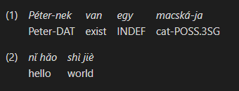
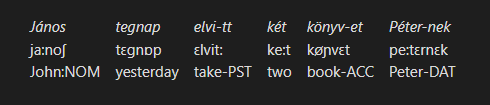
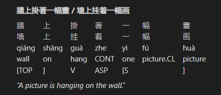
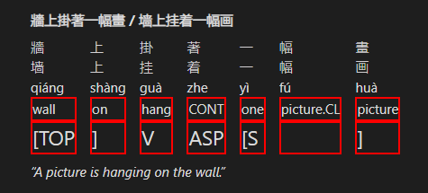
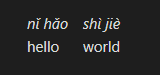
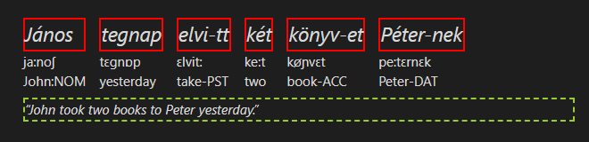
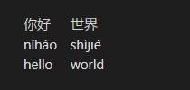
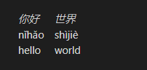

# Obsidian Interlinear Glosses

This plugin adds support for [interlinear glosses](https://en.wikipedia.org/wiki/Interlinear_gloss) often used in linguistics documents.
It's primarily meant for members of the constructed language community that use Obsidian for documenting their conlangs.

# Usage

Glosses are written using code blocks with a `gloss` tag, like this:

````
```gloss
# This is an interlinear gloss block
```
````

Lines starting with `#` are consired as comments and are ignored by the parser. Blank lines and lines consisting only of whitespace are ignored as well.

## Basic gloss lines (`\gla`, `\glb`)

A basic gloss consists of two lines, the source language text and the metalanguage. This can be achieved using `\gla` (gloss level A) and `\glb` (gloss level B) commands. These commands take space-separated lists of elements (words or morphemes), which will be aligned vertically element-by-element. By default level A lines have an italics style applied, while level B lines have no default style.

```gloss
\gla Péter-nek van egy macská-ja
\glb Peter-DAT exist INDEF cat-POSS.3SG
```


Additionally, if there's a need to use whitespace within a single gloss element, it can be wrapped in square brackets `[like this]`. To use the brackets verbatim in a gloss element, they can be "escaped" by prefixing with a caret symbol like `^[this^]`. Empty square brackets `[]` can be used to write a blank element in a gloss.

```gloss
\gla János tegnap [vi-tt el] két könyv-et Péter-nek
\glb John^[TOP^] yesterday^[FOC^] [take-PST away] two book-ACC Peter-DAT
```


## Additional gloss line (`\glc`)

If an additional line is needed, e.g. for the transcription, the `\glc` (gloss level C) command can be used, which functions just like `\gla` and `\glb` commands. Level C lines have no default style, just like level B.

```gloss
\gla Péter-nek van egy macská-ja
\glb pe:tɛrnɛk vɒn ɛɟ mɒt͡ʃka:jɒ
\glc Peter-DAT exist INDEF cat-POSS.3SG
```


## Free tranlsation (`\ft`)

A free translation line can be added at the bottom of the gloss using the `\ft` command, which takes a line of text. By default, free translation lines are wrapped in quotation marks and have an italics style applied.

```gloss
\gla Péter-nek van egy macská-ja
\glb pe:tɛrnɛk vɒn ɛɟ mɒt͡ʃka:jɒ
\glc Peter-DAT exist INDEF cat-POSS.3SG
\ft Peter has a cat.
```


## Source text (`\ex`)

An original source text line can be assed above the gloss using the `\ex` command, which takes a line of text like the `\ft` command. By default, original text lines have a bold style applied.

```gloss
\ex Péternek van egy macskája.
\gla Péter-nek van egy macská-ja
\glb pe:tɛrnɛk vɒn ɛɟ mɒt͡ʃka:jɒ
\glc Peter-DAT exist INDEF cat-POSS.3SG
\ft Peter has a cat.
```


## Line breaks

If a command line feels too long, it may be broken into multiple lines by indenting the subsequent lines. Additionally, blank lines are ignored and can be used to separate commands that span multiple lines. The following two examples produce the same result, shown below:

```gloss
\ex János tegnap elvitt két könyvet Péternek.
\gla János tegnap elvi-tt két könyv-et Péter-nek.
\glb John:NOM yesterday take-PST two book-ACC Peter-DAT
\ft John took two books to Peter yesterday.
```

```gloss
\ex János tegnap elvitt két könyvet Péternek.

\gla János tegnap
    elvi-tt két
    könyv-et Péter-nek.

\glb John:NOM yesterday
    take-PST two
    book-ACC Peter-DAT

\ft John took two books to Peter yesterday.
```


## Numbering (`\num`)

A gloss can be numbered using the `\num` command for the purpose of referencing it from the rest of the document. Currently, this command takes a line of text that is directly used as the label for the gloss. This may be replaced with an auto-numbering system in the future.

```
\num 1
\gla Péter-nek van egy macská-ja
\glb Peter-DAT exist INDEF cat-POSS.3SG
```

```
\num 2
\gla [nǐ hǎo] [shì jiè]
\glb hello world
```



## Alternative syntax (`\gl`)

An alternative syntax for gloss lines is available, where source language elements are adjacent to their glosses in the markup. This has an advantage of making the markup easier to read and write, especially for longer glosses.

To use this syntax, a code block with `ngloss` tag is used, instead of the regular `gloss` tag as seen earlier:

````
```ngloss
# This gloss will use the alternative syntax
```
````

In this mode, commands for individual gloss lines (`\gla`, `\glb`, `\glc`) are replaced with the single `\gl` command. This command accepts a space-separated list of tokens that are interpreted as follows:

- A regular bare `token` is always treated as a new level A (1st line) element
- A `[token]` surrounded in square brackets that follows a regular `token` is a level B (2nd line) element, that corresponds to the last level A element
- Any additional bracketed `[token]`s add further lines to the last level A element
	- Note that this mechanism allows for adding more than 3 gloss lines, as shown below

```ngloss
\gl János [ja:noʃ] [John:NOM]
	tegnap [tɛgnɒp] [yesterday]
	elvi-tt [ɛlvit:] [take-PST]
	két [ke:t] [two]
	könyv-et [køɲvɛt] [book-ACC]
	Péter-nek [pe:tɛrnɛk] [Peter-DAT]
```



```ngloss
\set glastyle cjk
\ex 牆上掛著一幅畫 / 墙上挂着一幅画
\gl 牆 [墙] [qiáng] [wall] [^[TOP]
	上 [上] [shàng] [on] [^]]
	掛 [挂] [guà] [hang] [V]
	著 [着] [zhe] [CONT] [ASP]
	一 [一] [yì] [one] [^[S]
	幅 [幅] [fú] [picture.CL] []
	畫 [画] [huà] [picture] [^]]
\ft A picture is hanging on the wall.
```



While it is generally cleaner to write each element on its own line, as in the example above, it is not strictly necessary and all tokens can be placed on the line following the `\gl` command for the same result. Additionally, spaces between bracketed `[tokens]` are not required, unlike between bare tokens. (Spaces within `[tokens]` work the same way as in the other syntax.)

The following example produces the same result as the one above, although the readability is generally worse:

```ngloss
\gl János[ja:noʃ][John:NOM]  tegnap[tɛgnɒp][yesterday]  elvi-tt[ɛlvit:][take-PST]  két[ke:t][two]  könyv-et[køɲvɛt][book-ACC]  Péter-nek[pe:tɛrnɛk][Peter-DAT]
```

## Custom styles

All parts of a rendered gloss block have CSS classes assigned, so their appearance can be customized using [CSS snippets](https://help.obsidian.md/Extending+Obsidian/CSS+snippets). Below is the list of available CSS classes with examples.

### `.ling-gloss-body`

This class represents the contents of a gloss block as a whole.

```css
.ling-gloss-body { border: solid 2px red; }
```


### `.ling-gloss-elements`

This class represents the sub-block containing the gloss lines with the vertically aligned elements.

```css
.ling-gloss-elements { border: solid 2px red; }
```


### `.ling-gloss-preamble`

This class represents the unmodified source text (preamble) line.

```css
.ling-gloss-preamble { border: solid 2px red; }
```


### `.ling-gloss-translation`

This class represents the free translation line.

```css
.ling-gloss-translation { border: solid 2px red; }
```


### `.ling-gloss-element`

This class represents a single group of vertically aligned gloss elements.

```css
.ling-gloss-element { border: solid 2px red; }
```


### `.ling-gloss-level-*`

These classes represent an element on a specific gloss line, where `*` is one of the lowercase letters `a`, `b`, `c` or `x`, that corresponds to the level of that line.

```css
.ling-gloss-level-a { border: dotted 2px red; }
.ling-gloss-level-b { border: dashed 2px yellowgreen; }
.ling-gloss-level-c { border: solid 2px blueviolet; }
```


Note that the `level-x` style applies to *all* lines after the level C line, however, the CSS sibling selector `:nth-child(n)` can be used to target a specific line. The `n` count for level X lines starts from 4, since the first three lines are the levels A, B and C.

```css
.ling-gloss-level-x { border: solid 2px red; }
.ling-gloss-level-x:nth-child(5) { font-size: 1.5em; }
```

```ngloss
\set glastyle cjk
\ex 牆上掛著一幅畫 / 墙上挂着一幅画
\gl 牆 [墙] [qiáng] [wall] [^[TOP]
	上 [上] [shàng] [on] [^]]
	掛 [挂] [guà] [hang] [V]
	著 [着] [zhe] [CONT] [ASP]
	一 [一] [yì] [one] [^[S]
	幅 [幅] [fú] [picture.CL] []
	畫 [画] [huà] [picture] [^]]
\ft A picture is hanging on the wall.
```



## Setting Options (`\set`)

There are some options that can be changed for an individual gloss block using the `\set` command, which takes an option name and, depending on the command:

- No values (for binary switch options)
- A single value (multiple spaces between value tokens are collapsed into a single one)
- A list of values (bracketed `[tokens]` can be used for values with spaces in them)

Below is the list of available options with examples.

### `glaspaces`

This option enables using underscore characters for whitespace in level A elements. It's particularly useful for `ngloss` syntax as bracketed tokens that support whitespace can't be used in level A. This option takes no values.

```ngloss
\set glaspaces
\gl nǐ_hǎo [hello]
    shì_jiè [world]
```



### `style`, `gl*style`, `exstyle`, `ftstyle`

These options assign custom CSS classes to various parts of a rendered gloss to allow for selective customization of individual glosses. All these options accept a list of CSS class names as values. Each command targets a specific part of a gloss as follows:

- `style` – Targets the the gloss contents as a whole. Useful for styles that target multiple parts of a gloss at once.
- `gl*style` – Targets an element on a specific gloss line, where `*` is one of the lowercase letters `a`, `b`, `c` or `x`, that corresponds to the level of that line.
	- Note that `glxstyle` applies to *all* lines after the level C line. See [`.ling-gloss-level-*`](#ling-gloss-level) for details.
- `exstyle` – Targets the unmodified source text (preamble) line.
- `ftstyle` – targets the free translation line.

For each provided class name, a CSS class called `.ling-style-*` is assigned to the target, where `*` is the provided class name.

For example, assuming these styles defined in a CSS snippet:
```css
.ling-style-big { font-size: 1.5em; }
.ling-style-solid { border: solid 2px red; }
.ling-style-dashed { border: dashed 2px yellowgreen; }
```

The following gloss should be displayed as shown here:

```ngloss
\set glastyle big solid
\set ftstyle dashed
\gl János [ja:noʃ] [John:NOM]
    tegnap [tɛgnɒp] [yesterday]
    elvi-tt [ɛlvit:] [take-PST]
    két [ke:t] [two]
    könyv-et [køɲvɛt] [book-ACC]
    Péter-nek [pe:tɛrnɛk] [Peter-DAT]
\ft John took two books to Peter yesterday.
```



By default, the plugin defines a style called `cjk` for the `glastyle` option that removes the default italics styling. This is meant to be used with CJK characters which do not normally use italics:

```ngloss
\set glastyle cjk
\gl 你好 [nǐhǎo] [hello]
	世界 [shìjiè] [world]
```



And the same gloss with the `\set` line removed:



# Installation

## Obsidian plugin repository

You can now install this plugin from the official community plugin repository by going to *Settings → Community plugins → Browse* in Obsidian and searching for “Interlinear Glossing”.

## Manual installation (deprecated)

- Create a folder called `ling-gloss` anywhere
- Go to the ["Releases"](https://github.com/Mijyuoon/obsidian-ling-gloss/releases) page and download `main.js`, `manifest.json` and `styles.css` files from the latest version
- Copy the files you've downloaded into the folder you've created earlier
- Open your vault's plugins folder at `<Vault Folder>/.obsidian/plugins` and put your folder there
- Reload the plugins in Obsidian settings or restart the program
- Enable the "Interlinear Glossing" plugin in Obsidian settings
