# Obsidian Interlinear Glosses

This plugin adds support for [interlinear glosses](https://en.wikipedia.org/wiki/Interlinear_gloss) often used in linguistics documents.
It's primarily meant for members of the constructed language community that use Obsidian for documenting their conlangs.

# Usage

Glosses are written using code blocks with a `gloss` tag, like this:

````
```gloss
# This is an interlinear gloss block
```
````

Lines starting with `#` are consired as comments and are ignored by the parser. Blank lines and lines consisting only of whitespace are ignored as well.

## Basic gloss lines (`\gla`, `\glb`)

A basic gloss consists of two lines, the source language text and the metalanguage. This can be achieved using `\gla` (gloss level A) and `\glb` (gloss level B) commands. These commands take space-separated lists of elements (words or morphemes), which will be aligned vertically element-by-element. By default level A lines have an italics style applied, while level B lines have no default style.

```gloss
\gla Péter-nek van egy macská-ja
\glb Peter-DAT exist INDEF cat-POSS.3SG
```

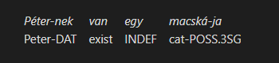

## Additional gloss line (`\glc`)

If an additional line is needed, e.g. for the transcription, the `\glc` (gloss level C) command can be used, which functions just like `\gla` and `\glb` commands. Level C lines have no default style, just like level B.

```gloss
\gla Péter-nek van egy macská-ja
\glb pe:tɛrnɛk vɒn ɛɟ mɒt͡ʃka:jɒ
\glc Peter-DAT exist INDEF cat-POSS.3SG
```

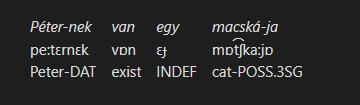

## Free tranlsation (`\ft`)

A free translation line can be added at the bottom of the gloss using the `\ft` command, which takes a line of text. By default, free translation lines are wrapped in quotation marks and have an italics style applied.

```gloss
\gla Péter-nek van egy macská-ja
\glb pe:tɛrnɛk vɒn ɛɟ mɒt͡ʃka:jɒ
\glc Peter-DAT exist INDEF cat-POSS.3SG
\ft Peter has a cat.
```

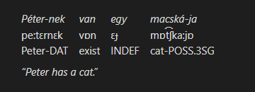

## Source text (`\ex`)

An original source text line can be assed above the gloss using the `\ex` command, which takes a line of text like the `\ft` command. By default, original text lines have a bold style applied.

```gloss
\ex Péternek van egy macskája.
\gla Péter-nek van egy macská-ja
\glb pe:tɛrnɛk vɒn ɛɟ mɒt͡ʃka:jɒ
\glc Peter-DAT exist INDEF cat-POSS.3SG
\ft Peter has a cat.
```

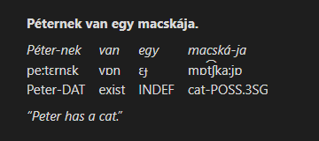

## Line breaks

If a command line feels too long, it may be broken into multiple lines by indenting the subsequent lines. Additionally, blank lines are ignored and can be used to separate commands that span multiple lines. The following two examples produce the same result, shown below:

```gloss
\ex János tegnap elvitt két könyvet Péternek.
\gla János tegnap elvi-tt két könyv-et Péter-nek.
\glb John:NOM yesterday take-PST two book-ACC Peter-DAT
\ft John took two books to Peter yesterday.
```

```gloss
\ex János tegnap elvitt két könyvet Péternek.

\gla János tegnap
    elvi-tt két
    könyv-et Péter-nek.

\glb John:NOM yesterday
    take-PST two
    book-ACC Peter-DAT

\ft John took two books to Peter yesterday.
```

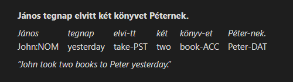

## Alternative syntax (`\gl`)

An alternative syntax for gloss lines is available, where source language elements are adjacent to their glosses in the markup. This has an advantage of making the markup easier to read and write, especially for longer glosses.

To use this syntax, a code block with `ngloss` tag is used, instead of the regular `gloss` tag as seen earlier:

````
```ngloss
# This gloss will use the alternative syntax
```
````

In this mode, commands for individual gloss lines (`\gla`, `\glb`, `\glc`) are replaced with the single `\gl` command. This command accepts a space-separated list of tokens that are interpreted as follows:

- A regular bare `token` is always treated as a new level A (1st line) element
- A `[token]` surrounded in square brackets that follows a regular `token` is a level B (2nd line) element, that corresponds to the last level A element
- Any additional bracketed `[token]`s add further lines to the last level A element
  *(Note: currently only one extra line, level C, will be shown)*

```ngloss
\gl János [ja:noʃ] [John:NOM]
	tegnap [tɛgnɒp] [yesterday]
	elvi-tt [ɛlvit:] [take-PST]
	két [ke:t] [two]
	könyv-et [køɲvɛt] [book-ACC]
	Péter-nek [pe:tɛrnɛk] [Peter-DAT]
```


While it is generally cleaner to write each element on its own line, as in the example above, it is not strictly necessary and all tokens can be placed on the line following the `\gl` command for the same result. Additionally, spaces between bracketed `[tokens]` are not required, unlike between bare tokens.

The following example produces the same result as the one above, although the readability is generally worse:

```ngloss
\gl János[ja:noʃ][John:NOM]  tegnap[tɛgnɒp][yesterday]  elvi-tt[ɛlvit:][take-PST]  két[ke:t][two]  könyv-et[køɲvɛt][book-ACC]  Péter-nek[pe:tɛrnɛk][Peter-DAT]
```

## Custom styles

All parts of a rendered gloss block have CSS classes assigned, so their appearance can be customized using [CSS snippets](https://help.obsidian.md/Extending+Obsidian/CSS+snippets). Below is the list of available CSS classes with examples.

### `.ling-gloss`

This class represents the gloss block as a whole.

```css
.ling-gloss { border: solid 2px red; }
```

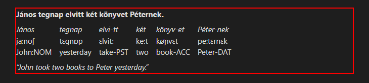

### `.ling-gloss-elements`

This class represents the sub-block containing the gloss lines with the vertically aligned elements.

```css
.ling-gloss-elements { border: solid 2px red; }
```

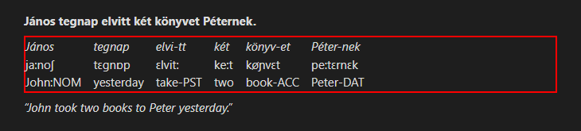

### `.ling-gloss-preamble`

This class represents the unmodified source text (preamble) line.

```css
.ling-gloss-preamble { border: solid 2px red; }
```

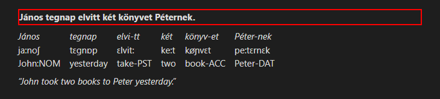

### `.ling-gloss-translation`

This class represents the free translation line.

```css
.ling-gloss-translation { border: solid 2px red; }
```

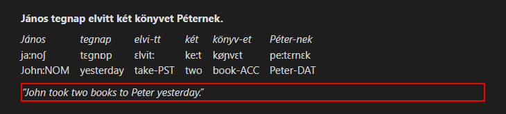

### `.ling-gloss-element`

This class represents a single group of vertically aligned gloss elements.

```css
.ling-gloss-element { border: solid 2px red; }
```

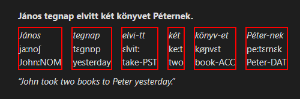

### `.ling-gloss-level-*`

These classes represent an element on a specific gloss line, where `*` is a single lowercase letter between `a` and `c` that corresponds to the level of that line.

```css
.ling-gloss-level-a { border: dotted 2px red; }
.ling-gloss-level-b { border: dashed 2px yellowgreen; }
.ling-gloss-level-c { border: solid 2px blueviolet; }
```

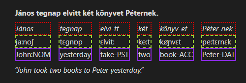


# Installation

## Manual installation

- Create a folder called `obsidian-ling-gloss` anywhere
- Go to the ["Releases"](https://github.com/Mijyuoon/obsidian-ling-gloss/releases) page and download `main.js`, `manifest.json` and `styles.css` files from the latest version
- Copy the files you've downloaded into the folder you've created earlier
- Open your vault's plugins folder at `<Vault Folder>/.obsidian/plugins` and put your folder there
- Reload the plugins in Obsidian settings or restart the program
- Enable the "Interlinear Glossing" plugin in Obsidian settings